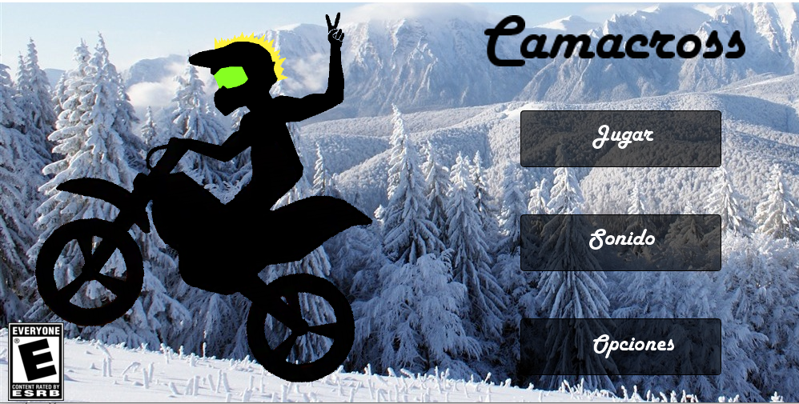

CAMACROSS
================
🏁🏆🥇🏁
Acompaña a Camacross en su aventura por las montañas nevadas.

Una aventura sin fin que se va complicando a medida que Camacross avanza en su travesía.

`Camacross` es un **proyecto privado colaborativo** creado por:
 
- Sergio Andrés Angarita Camacho. 
- Jesse Solomon Blair Camacho.

### Características
 
- Juego tipo sin fin. 
- Manual interactivo de controles del juego.
- Opciones de jugabilidad con o sin música y esfectos. 
- Referencias para los elementos no propios empleados en el juego.

